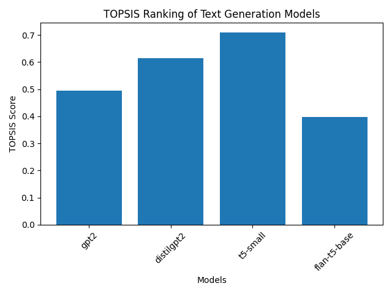
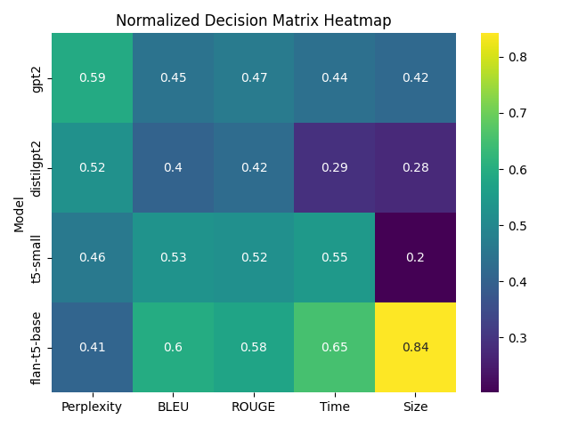

# TOPSIS-Based Text Generation Model Selection

> A multi-criteria decision-making framework for intelligent model selection

## Overview

This project implements **TOPSIS** (Technique for Order Preference by Similarity to Ideal Solution) to objectively rank pre-trained text generation models across multiple performance dimensions.

Instead of relying on a single metric, this analysis evaluates models holistically across language quality, generation accuracy, and computational efficiency to provide a mathematically grounded ranking.

---

## Problem Statement

When selecting a pre-trained text generation model, multiple criteria must be considered:

- Some metrics should be maximized (e.g., BLEU, ROUGE)
- Some metrics should be minimized (e.g., Perplexity, Inference Time, Model Size)

The challenge is to determine the best model when criteria conflict with one another.

TOPSIS provides a mathematical framework to rank alternatives based on their relative distance from an ideal best and ideal worst solution.

---

## Models Under Evaluation

- **GPT-2** - OpenAI's generative pre-trained transformer  
- **DistilGPT2** - Lightweight distilled version of GPT-2  
- **T5-Small** - Google's text-to-text transfer transformer (small variant)
- **FLAN-T5-Base** - Instruction-tuned T5 base model  

---

## Evaluation Criteria

| Criterion        | Type       | Direction | Rationale |
|------------------|------------|-----------|-----------|
| Perplexity       | Cost       | ↓ Minimize | Language coherence |
| BLEU Score       | Benefit    | ↑ Maximize | Translation quality |
| ROUGE-L Score    | Benefit    | ↑ Maximize | Summary/paraphrase fidelity |
| Inference Time   | Cost       | ↓ Minimize | Latency constraints |
| Model Size (MB)  | Cost       | ↓ Minimize | Memory footprint |

---

## Criteria Weights

| Perplexity | BLEU | ROUGE-L | Inf. Time | Model Size |
|:----------:|:----:|:-------:|:---------:|:----------:|
| **0.25**   | 0.25 |  0.20   |   0.15    |    0.15    |

**Weighting Strategy:** Equal emphasis on language quality metrics (Perplexity + BLEU + ROUGE = 70%), with secondary focus on computational constraints (Time + Size = 30%).

---

## TOPSIS Methodology

The algorithm ranks alternatives through the following sequential steps:

1. **Construct** the decision matrix from criteria values
2. **Normalize** using vector normalization (min-max scaling)
3. **Weightify** by applying normalized weights
4. **Identify** ideal-positive and ideal-negative solutions
5. **Distance** calculation (Euclidean from both ideals)
6. **Score** computation using relative proximity
7. **Rank** alternatives by descending score

### TOPSIS Score Formula

$$C_i = \frac{d_i^-}{d_i^+ + d_i^-}$$

Where:
- $d_i^+$ = Euclidean distance to the ideal-best solution
- $d_i^-$ = Euclidean distance to the ideal-worst solution

**Interpretation:** Score ranges from 0 to 1. Higher score = better alternative.

---

## Project Structure

```
TOPSIS-Text-Generation/
│
├── data/
│   └── decision_matrix.csv
│
├── results/
│   ├── normalized_matrix.csv
│   ├── weighted_matrix.csv
│   └── topsis_scores.csv
│
├── outputs/
│   ├── ranking_plot.png
│   ├── heatmap.png
│   └── analysis.html
│
├── notebooks/
│   └── analysis.ipynb
│
├── src/
│   ├── topsis.py
│   └── utils.py
│
├── main.py
├── requirements.txt
└── README.md
```

---

## Results & Visualizations

### Model Rankings
View the comparative ranking plot:



### Score Distribution Heatmap
Visual representation of normalized scores across criteria:



---

## Final Rankings

Complete ranking results are available in [`results/topsis_scores.csv`](results/topsis_scores.csv)

The highest-scoring model represents the optimal balance across all selected criteria and weights.

---


## Quick Start

```bash
# Install dependencies
pip install -r requirements.txt

# Run the analysis
python main.py
```

### What This Does
- Loads the decision matrix from `data/decision_matrix.csv`
- Executes TOPSIS algorithm with specified weights
- Generates ranking scores and normalized matrices
- Saves intermediate results to `results/` directory
- Creates visualization plots in `outputs/`  

---

## Why TOPSIS?

- **Handles Conflicts** - Effectively resolves trade-offs between competing criteria
- **Mathematically Sound** - Provides objective, reproducible rankings
- **Balanced Analysis** - Considers both quality and efficiency constraints
- **Practical** - Well-suited for real-world model selection scenarios
- **Interpretable** - Results are easy to explain to stakeholders  

---

## Future Enhancements

- [ ] Automate metric extraction from live model evaluations
- [ ] Scale to larger language models (GPT-3, LLaMA, Mistral)
- [ ] Integrate BERTScore and semantic similarity metrics
- [ ] Build interactive web dashboard for dynamic comparison
- [ ] Add sensitivity analysis for weight adjustments  

---

## About

**Author:** Shivam Kumar  
**Roll Number:** 102303881

---
